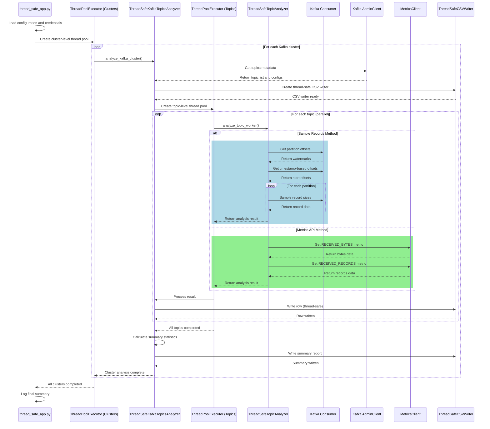

# Kafka Topics Partition Count Recommender [MULTITHREADED] Application

> **TL;DR:** _**End Kafka performance headaches.** This smart recommender reads your historical consumption data and delivers precise partition recommendations that optimize throughput and enable effortless scaling—no more over-provisioning or under-utilizing your topics._


The **Kafka Cluster Topics Partition Count Recommender [MULTITHREADED] Application** offers data-driven accuracy for Kafka topic sizing. By analyzing past consumption trends, that is, the average consumption records in bytes, it uses this information to determine consumer throughput. Then, over a rolling n-day period, it identifies the average consumption of records in bytes, scaling that number by a factor of X to forecast future demand and calculate the required throughput. Next, it divides the required throughput by the consumer throughput and rounds the result to the nearest whole number to determine the optimal number of partitions. The result is an intelligent, automated recommendation system that ensures each Kafka topic has the appropriate number of partitions to handle current workload and support future growth effectively.

**Table of Contents**

<!-- toc -->
- [**1.0 To get started**](#10-to-get-started)
   + [**1.1 Download the Application**](#11-download-the-application)
      - [**1.1.1 Special Note on two custom dependencies**](#111-special-note-on-two-custom-dependencies)
   + [**1.2 Configure the Application**](#12-configure-the-application)
      - [**1.2.1 Create the `.env` file**](#121-create-the-env-file)
      - [**1.2.2 Using the AWS Secrets Manager (optional)**](#122-using-the-aws-secrets-manager-optional)
   + [**1.3 Run the Application**](#13-run-the-application)
      - [**1.3.1 Did you notice we prefix `uv run` to `python src/thread_safe_app.py`?**](#131-did-you-notice-we-prefix-uv-run-to-python-srcapppy)
      - [**1.3.2 Troubleshoot Connectivity Issues (if any)**](#132-troubleshoot-connectivity-issues-if-any)
   + [**1.4 The Results**](#14-the-results)
- [**2.0 How the app calculates the recommended partition count**](#20-how-the-app-calculates-the-recommended-partition-count)
   + [**2.1 End-to-End Application Workflow**](#21-end-to-end-application-workflow)
- [**3.0 Unlocking High-Performance Consumer Throughput**](#30-unlocking-high-performance-consumer-throughput)
   + [**3.1 Key Factors Affecting Consumer Throughput**](#31-key-factors-affecting-consumer-throughput)
      - [**3.1.1 Partitions**](#311-partitions)
      - [**3.1.2 Consumer Parallelism**](#312-consumer-parallelism)
      - [**3.1.3 Fetch Configuration**](#313-fetch-configuration)
      - [**3.1.4 Batch Size**](#314-batch-size)
      - [**3.1.5 Message Size**](#315-message-size)
      - [**3.1.6 Network Bandwidth**](#316-network-bandwidth)
      - [**3.1.7 Deserialization Overhead**](#317-deserialization-overhead)
      - [**3.1.8 Broker Load**](#318-broker-load)
      - [**3.1.9 Consumer Poll Frequency**](#319-consumer-poll-frequency)
      - [**3.1.10 System Resources**](#310-system-resources)
+ [**3.2 Typical Consumer Throughput**](#32-typical-consumer-throughput)
+ [**3.3 Seven Strategies to Improve Consumer Throughput**](#33-seven-strategies-to-improve-consumer-throughput)
- [**4.0 Resources**](#40-resources)
   + [**4.1 Optimization Guides**](#41-optimization-guides)
   + [**4.2 Confluent Cloud Metrics API**](#42-confluent-cloud-metrics-api)
   + [**4.3 Confluent Kafka Python Client**](#43-confluent-kafka-python-client)
<!-- tocstop -->

## 1.0 To get started

**_Download_** ---> **_Configure_** ---> **_Run_** ---> **_Results_**

### 1.1 Download the Application
Clone the repo:
    ```shell
    git clone https://github.com/j3-signalroom/kafka_cluster-topics-partition_count_recommender-app.git
    ```

Since this project was built using [**`uv`**](https://docs.astral.sh/uv/), please [install](https://docs.astral.sh/uv/getting-started/installation/) it, and then run the following command to install all the project dependencies:
   ```shell
   uv sync
   ```

#### 1.1.1 Special Note on two custom dependencies
This project has _two custom dependencies_ that we want to bring to your attention:

1. **[`cc-clients-python_lib`](https://github.com/j3-signalroom/cc-clients-python_lib)**: _This library offers a simple way to interact with Confluent Cloud services, including the Metrics API. It makes it easier to send API requests and manage responses. It is used in this project to connect to the Confluent Cloud Metrics API and retrieve topic consumption metrics._

2. **[`aws-clients-python_lib`](https://github.com/j3-signalroom/aws-clients-python_lib)**: _This library is used to interact with AWS services, specifically AWS Secrets Manager in this case. It enables the application to securely retrieve secrets stored in AWS Secrets Manager._

### 1.2 Configure the Application

Now, you need to set up the application by creating a `.env` file in the root directory of your project. This file will store all the essential environment variables required for the application to connect to your Confluent Cloud Kafka cluster and function correctly. Additionally, you can choose to use **AWS Secrets Manager** to manage your secrets.

> **Note**: _Your Confluent Cloud API Key, Secret, and Kafka Cluster ID are required to access the [Confluent Cloud Metrics API](https://api.telemetry.confluent.cloud/docs#section/Authentication) and retrieve topic metrics. Additionally, your Bootstrap Server URI, along with your Kafka API Key and Secret, are necessary to access the designated Kafka Cluster._

#### 1.2.1 Create the `.env` file
Create the `.env` file and add the following environment variables, filling them with your Confluent Cloud credentials and other required values:
```shell
# Environment variables credentials for Confluent Cloud and Kafka clusters
CONFLUENT_CLOUD_CREDENTIAL={"confluent_cloud_api_key":"<YOUR_CONFLUENT_CLOUD_API_KEY>", "confluent_cloud_api_secret": "<YOUR_CONFLUENT_CLOUD_API_SECRETS>"}
KAFKA_CREDENTIALS=[{"kafka_cluster_id": "<YOUR_KAFKA_CLUSTER_ID>", "bootstrap.servers": "<YOUR_BOOTSTRAP_SERVER_URI>", "sasl.username": "<YOUR_KAFKA_API_KEY>", "sasl.password": "<YOUR_KAFKA_API_SECRET>"}]

# AWS Secrets Manager Secrets for Confluent Cloud and Kafka clusters
USE_AWS_SECRETS_MANAGER=<True|False>
CONFLUENT_CLOUD_API_SECRET_PATH={"region_name": "<YOUR_SECRET_AWS_REGION_NAME>", "secret_name": "<YOUR_CONFLUENT_CLOUD_API_KEY_AWS_SECRETS>"}
KAFKA_API_SECRET_PATHS=[{"region_name": "<YOUR_SECRET_AWS_REGION_NAME>", "secret_name": "<YOUR_KAFKA_API_KEY_AWS_SECRETS>"}]

# Topic analysis configuration
INCLUDE_INTERNAL_TOPICS=<True|False>
TOPIC_FILTER=<YOUR_TOPIC_FILTER, IF ANY>

# Minimum recommended partitions
MIN_RECOMMENDED_PARTITIONS=<YOUR_MIN_RECOMMENDED_PARTITIONS>

# Throughput and partition calculation configuration
REQUIRED_CONSUMPTION_THROUGHPUT_FACTOR=<YOUR_REQUIRED_CONSUMPTION_THROUGHPUT_FACTOR>

# Sampling configuration
USE_SAMPLE_RECORDS=<True|False>
SAMPLING_DAYS=<YOUR_SAMPLING_DAYS>
SAMPLING_BATCH_SIZE=<YOUR_SAMPLING_BATCH_SIZE>
SAMPLING_MAX_CONSECUTIVE_NULLS=<YOUR_SAMPLING_MAX_CONSECUTIVE_NULLS>
SAMPLING_TIMEOUT_SECONDS=<YOUR_SAMPLING_TIMEOUT_SECONDS>
SAMPLING_MAX_CONTINUOUS_FAILED_BATCHES=<YOUR_SAMPLING_MAX_CONTINUOUS_FAILED_BATCHES>

# Multithreading configuration
MAX_CLUSTER_WORKERS=<YOUR_MAX_CLUSTER_WORKERS>
MAX_WORKERS_PER_CLUSTER=<YOUR_MAX_WORKERS_PER_CLUSTER>
```

The environment variables are defined as follows:

| Environment Variable Name | Type | Description | Example | Default | Required |
|---------------|------|-------------|---------|---------|----------|
| `CONFLUENT_CLOUD_CREDENTIAL` | JSON Object | Contains authentication credentials for Confluent Cloud API access. Must include `confluent_cloud_api_key` and `confluent_cloud_api_secret` fields for authenticating with Confluent Cloud services. | `{"confluent_cloud_api_key": "CKABCD123456", "confluent_cloud_api_secret": "xyz789secretkey"}` | None | Yes (if not using AWS Secrets Manager) |
| `KAFKA_CREDENTIALS` | JSON Array | Array of Kafka cluster connection objects. Each object must contain `sasl.username`, `sasl.password`, `kafka_cluster_id`, and `bootstrap.servers` for connecting to specific Kafka clusters. | `[{"sasl.username": "ABC123", "sasl.password": "secret123", "kafka_cluster_id": "lkc-abc123", "bootstrap.servers": "pkc-123.us-east-1.aws.confluent.cloud:9092"}]` | None | Yes (if not using AWS Secrets Manager) |
| `USE_AWS_SECRETS_MANAGER` | Boolean | Controls whether to retrieve credentials from AWS Secrets Manager instead of using direct environment variables. When `True`, credentials are fetched from AWS Secrets Manager using the paths specified in other variables. | `True` or `False` | `False` | No |
| `CONFLUENT_CLOUD_API_SECRET_PATH` | JSON Object | AWS Secrets Manager configuration for Confluent Cloud credentials. Contains `region_name` (AWS region) and `secret_name` (name of the secret in AWS Secrets Manager). Only used when `USE_AWS_SECRETS_MANAGER` is `True`. | `{"region_name": "us-east-1", "secret_name": "confluent-cloud-api-credentials"}` | None | Yes (if `USE_AWS_SECRETS_MANAGER` is `True`) |
| `KAFKA_API_SECRET_PATHS` | JSON Array | Array of AWS Secrets Manager configurations for Kafka cluster credentials. Each object contains `region_name` and `secret_name` for retrieving cluster-specific credentials from AWS Secrets Manager. | `[{"region_name": "us-east-1", "secret_name": "kafka-cluster-1-creds"}, {"region_name": "us-east-1", "secret_name": "kafka-cluster-2-creds"}]` | None | Yes (if `USE_AWS_SECRETS_MANAGER` is `True`) |
| `INCLUDE_INTERNAL_TOPICS` | Boolean | Determines whether Kafka internal topics (system topics like `__consumer_offsets`, `_schemas`) are included in the analysis and reporting. Set to `False` to exclude internal topics and focus only on user-created topics. | `True` or `False` | `False` | No |
| `TOPIC_FILTER` | Comma-separated String | A list of specific topic names or part of topic names to analyze. When provided, only these topics will be included in the analysis. Use commas to separate multiple topic names. Leave blank or unset to analyze all available topics. | `"user-events,order-processing,payment-notifications"` | Empty (all topics) | No |
| `MIN_RECOMMENDED_PARTITIONS` | Integer | The minimum number of partitions to recommend for any topic, regardless of calculated needs. This ensures that topics have a baseline level of parallelism and fault tolerance. | `6`, `12` | `6` | No |
| `MIN_CONSUMPTION_THROUGHPUT` | Integer | The minimum required consumption throughput for any topic, regardless of calculated needs. This ensures that topics have a baseline level of performance. | `10485760` (10 MB/s) | `10485760` | No |
| `REQUIRED_CONSUMPTION_THROUGHPUT_FACTOR` | Float/Integer | Multiplier applied to current peak consumption rates for capacity planning and future demand forecasting. A value of `3` means planning for 3x the current peak throughput (300% of current load). | `3` (for 300%), `2.5` (for 250%) | `3` | No |
| `USE_SAMPLE_RECORDS` | Boolean | Enables record sampling mode for analysis instead of processing all records. When `True`, only a subset of records is analyzed for performance optimization. Recommended for large topics or initial analysis. | `True` or `False` | `True` | No |
| `SAMPLING_BATCH_SIZE` | Integer | Maximum number of records to sample per topic when `USE_SAMPLE_RECORDS` is `True`. Controls the sample size for analysis to balance accuracy with performance. Larger values provide more accurate analysis but slower processing. | `1000`, `10000` | `10000` | No |
| `SAMPLING_MAX_CONSECUTIVE_NULLS` | Integer | Maximum number of consecutive null records encountered during sampling before stopping the sampling process for a topic. Helps to avoid excessive polling when there are no new records. | `10`, `50` | `50` | No |
| `SAMPLING_TIMEOUT_SECONDS` | Float | Maximum time (in seconds) to wait for records during sampling before stopping the sampling process for a topic. Prevents long waits when there are no new records. | `1.0`, `2.5` | `2.0` | No |
| `SAMPLING_MAX_CONTINUOUS_FAILED_BATCHES` | Integer | Maximum number of continuous failed batches encountered during sampling before stopping the sampling process for a topic. Helps to avoid excessive retries when there are persistent issues. | `3`, `5` | `5` | No |
| `SAMPLING_DAYS` | Integer | Time window (in days) for record sampling, creating a rolling window that looks back from the current time. Defines how far back to sample records for analysis. **Note**: Topics with retention periods shorter than this value will use their maximum available retention period instead. | `7` (last week), `30` (last month) | `7` | No |
| `MAX_CLUSTER_WORKERS` | Integer | Maximum number of concurrent worker threads to analyze multiple Kafka clusters in parallel. Helps to speed up analysis when working with multiple clusters. | `2`, `4` | `3` | No |
| `MAX_WORKERS_PER_CLUSTER` | Integer | Maximum number of concurrent worker threads to analyze multiple topics within a single Kafka cluster in parallel. Helps to speed up analysis for clusters with many topics. | `4`, `8` | `8` | No |

#### 1.2.2 Using the AWS Secrets Manager (optional)
If you use **AWS Secrets Manager** to manage your secrets, set the `USE_AWS_SECRETS_MANAGER` variable to `True` and the application will retrieve the secrets from AWS Secrets Manager using the names provided in `CONFLUENT_CLOUD_API_KEY_AWS_SECRETS` and `KAFKA_API_KEY_AWS_SECRETS`.  

The code expects the `CONFLUENT_CLOUD_API_KEY_AWS_SECRETS` to be stored in JSON format with these keys:
- `confluent_cloud_api_key`
- `confluent_cloud_api_secret`

The code expects the `KAFKA_API_KEY_AWS_SECRETS` to be stored in JSON format with these keys:
- `kafka_cluster_id` 
- `bootstrap.servers`
- `sasl.username`
- `sasl.password`

### 1.3 Run the Application

**Navigate to the Project Root Directory**

Open your Terminal and navigate to the root folder of the `kafka_cluster-topics-partition_count_recommender-app/` repository that you have cloned. You can do this by executing:

```shell
cd path/to/kafka_cluster-topics-partition_count_recommender-app/
```

> Replace `path/to/` with the actual path where your repository is located.

Then enter the following command below to run the application:
```shell
uv run python src/thread_safe_app.py
```

If `USE_SAMPLE_RECORDS` environment variable is set to `True`, the application will sample records from each topic to calculate the average record size in bytes.  For example, below is a screenshot of the application running successfully:

```log
2025-09-25 23:15:35 - INFO - main - Retrieving the Confluent Cloud credentials from the .env file.
2025-09-25 23:15:35 - INFO - main - Retrieving the Kafka Cluster credentials from the .env file.
2025-09-25 23:15:35 - INFO - main - ====================================================================================================
2025-09-25 23:15:35 - INFO - main - MULTITHREADED KAFKA CLUSTER ANALYSIS STARTING
2025-09-25 23:15:35 - INFO - main - ----------------------------------------------------------------------------------------------------
2025-09-25 23:15:35 - INFO - main - Number of Kafka clusters to analyze: 1
2025-09-25 23:15:35 - INFO - main - Max concurrent Kafka clusters: 4
2025-09-25 23:15:35 - INFO - main - Max concurrent topics per cluster: 8
2025-09-25 23:15:35 - INFO - main - Analysis method: Record sampling
2025-09-25 23:15:35 - INFO - main - ====================================================================================================
2025-09-25 23:15:53 - INFO - __log_initial_parameters - ====================================================================================================
2025-09-25 23:15:53 - INFO - __log_initial_parameters - INITIAL ANALYSIS PARAMETERS
2025-09-25 23:15:53 - INFO - __log_initial_parameters - ----------------------------------------------------------------------------------------------------
2025-09-25 23:15:53 - INFO - __log_initial_parameters - Analysis Timestamp: 2025-09-25T23:15:53.448048
2025-09-25 23:15:53 - INFO - __log_initial_parameters - Kafka Cluster ID: lkc-r9mvmp
2025-09-25 23:15:53 - INFO - __log_initial_parameters - Max worker threads: 8
2025-09-25 23:15:53 - INFO - __log_initial_parameters - Connecting to Kafka cluster and retrieving metadata...
2025-09-25 23:15:53 - INFO - __log_initial_parameters - Found 2 topics to analyze
2025-09-25 23:15:53 - INFO - __log_initial_parameters - Excluding internal topics
2025-09-25 23:15:53 - INFO - __log_initial_parameters - Required consumption throughput factor: 10.0
2025-09-25 23:15:53 - INFO - __log_initial_parameters - Minimum required throughput threshold: 10.0 MB/s
2025-09-25 23:15:53 - INFO - __log_initial_parameters - Topic filter: None
2025-09-25 23:15:53 - INFO - __log_initial_parameters - Default Partition Count: 6
2025-09-25 23:15:53 - INFO - __log_initial_parameters - Using sample records for average record size calculation
2025-09-25 23:15:53 - INFO - __log_initial_parameters - Sampling batch size: 10,000 records
2025-09-25 23:15:53 - INFO - __log_initial_parameters - Sampling days: 1 days
2025-09-25 23:15:53 - INFO - __log_initial_parameters - Sampling max consecutive nulls: 50 records
2025-09-25 23:15:53 - INFO - __log_initial_parameters - Sampling timeout: 2.0 seconds
2025-09-25 23:15:53 - INFO - __log_initial_parameters - Sampling max continuous failed batches: 5 batches
2025-09-25 23:15:53 - INFO - __log_initial_parameters - ====================================================================================================
2025-09-25 23:15:53 - INFO - analyze_all_topics - Created the lkc-r9mvmp-recommender-1758856553-detail-report.csv file
2025-09-25 23:15:53 - INFO - analyze_topic - [Thread-6156627968] Analyzing topic stock_trades with 1-day rolling window (from 2025-09-25T03:15:53+00:00)
2025-09-25 23:15:53 - INFO - analyze_topic - [Thread-6173454336] Analyzing topic stock_trades_with_totals with 1-day rolling window (from 2025-09-25T03:15:53+00:00)
2025-09-25 23:16:43 - INFO - _sample_record_sizes - [Thread-6156627968] Partition 000 of 006: using effective batch size 5,000 (requested: 10,000, optimal: 5,000)
2025-09-25 23:16:43 - INFO - _sample_record_sizes - [Thread-6156627968]     Sampling from partition 000 of 006: offsets [28396, 77350)
2025-09-25 23:16:48 - WARNING - _sample_record_sizes - [Thread-6156627968] Failed to seek for stock_trades 000 of 006: KafkaError{code=_ALL_BROKERS_DOWN,val=-187,str="Failed to get watermark offsets: Local: All broker connections are down"}
2025-09-25 23:16:48 - INFO - _sample_record_sizes - [Thread-6156627968] Partition 002 of 006: using effective batch size 5,000 (requested: 10,000, optimal: 5,000)
2025-09-25 23:16:48 - INFO - _sample_record_sizes - [Thread-6156627968]     Sampling from partition 002 of 006: offsets [14046, 38707)
2025-09-25 23:17:00 - INFO - _sample_record_sizes - [Thread-6173454336] Partition 000 of 006: using effective batch size 5,000 (requested: 10,000, optimal: 5,000)
2025-09-25 23:17:00 - INFO - _sample_record_sizes - [Thread-6173454336]     Sampling from partition 000 of 006: offsets [14889, 41999)
2025-09-25 23:17:03 - WARNING - _sample_record_sizes - [Thread-6173454336] Failed to seek for stock_trades_with_totals 000 of 006: KafkaError{code=_STATE,val=-172,str="Failed to seek to offset 14889: Local: Erroneous state"}
2025-09-25 23:17:03 - INFO - _sample_record_sizes - [Thread-6173454336] Partition 001 of 006: using effective batch size 5,000 (requested: 10,000, optimal: 5,000)
2025-09-25 23:17:03 - INFO - _sample_record_sizes - [Thread-6173454336]     Sampling from partition 001 of 006: offsets [17432, 49459)
2025-09-25 23:17:04 - INFO - _sample_record_sizes - [Thread-6156627968]       Batch 1: 5,000 valid records (3 errors/nulls), progress: 20.3%, running avg: 85.39 bytes
2025-09-25 23:17:04 - INFO - _sample_record_sizes - [Thread-6156627968]       Batch 2: 5,000 valid records (0 errors/nulls), progress: 40.5%, running avg: 85.41 bytes
2025-09-25 23:17:04 - INFO - _sample_record_sizes - [Thread-6173454336]       Batch 1: 5,000 valid records (0 errors/nulls), progress: 15.6%, running avg: 35.43 bytes
2025-09-25 23:17:06 - INFO - _sample_record_sizes - [Thread-6173454336]       Batch 2: 5,000 valid records (0 errors/nulls), progress: 31.2%, running avg: 35.44 bytes
2025-09-25 23:17:07 - INFO - _sample_record_sizes - [Thread-6156627968]       Batch 3: 5,000 valid records (1 errors/nulls), progress: 60.8%, running avg: 85.42 bytes
2025-09-25 23:17:08 - INFO - _sample_record_sizes - [Thread-6173454336]       Batch 3: 5,000 valid records (1 errors/nulls), progress: 46.8%, running avg: 35.44 bytes
2025-09-25 23:17:08 - INFO - _sample_record_sizes - [Thread-6173454336]       Batch 4: 5,000 valid records (0 errors/nulls), progress: 62.4%, running avg: 35.45 bytes
2025-09-25 23:17:08 - INFO - _sample_record_sizes - [Thread-6156627968]       Batch 4: 5,000 valid records (0 errors/nulls), progress: 81.1%, running avg: 85.42 bytes
2025-09-25 23:17:10 - INFO - _sample_record_sizes - [Thread-6173454336]       Batch 5: 5,000 valid records (1 errors/nulls), progress: 78.1%, running avg: 35.45 bytes
2025-09-25 23:17:11 - INFO - _sample_record_sizes - [Thread-6156627968]       Batch 5: 4,661 valid records (2 errors/nulls), progress: 100.0%, running avg: 85.42 bytes
2025-09-25 23:17:11 - INFO - _sample_record_sizes - [Thread-6156627968] Partition 004 of 006: using effective batch size 5,000 (requested: 10,000, optimal: 5,000)
2025-09-25 23:17:11 - INFO - _sample_record_sizes - [Thread-6156627968]     Sampling from partition 004 of 006: offsets [13919, 38808)
2025-09-25 23:17:11 - INFO - _sample_record_sizes - [Thread-6173454336]       Batch 6: 5,000 valid records (0 errors/nulls), progress: 93.7%, running avg: 35.45 bytes
2025-09-25 23:17:11 - INFO - _sample_record_sizes - [Thread-6173454336]       Batch 7: 1,585 valid records (1 errors/nulls), progress: 98.6%, running avg: 35.45 bytes
2025-09-25 23:17:11 - WARNING - _sample_record_sizes - [Thread-6173454336]       Batch 8: No valid records processed (1 attempts, 0 consecutive nulls) [1/5 consecutive failures]
2025-09-25 23:17:11 - WARNING - _sample_record_sizes - [Thread-6173454336]       Batch 9: No valid records processed (1 attempts, 0 consecutive nulls) [2/5 consecutive failures]
2025-09-25 23:17:11 - WARNING - _sample_record_sizes - [Thread-6173454336]       Batch 10: No valid records processed (1 attempts, 0 consecutive nulls) [3/5 consecutive failures]
2025-09-25 23:17:11 - WARNING - _sample_record_sizes - [Thread-6173454336]       Batch 11: No valid records processed (1 attempts, 0 consecutive nulls) [4/5 consecutive failures]
2025-09-25 23:17:11 - WARNING - _sample_record_sizes - [Thread-6173454336]       Batch 12: No valid records processed (1 attempts, 0 consecutive nulls) [5/5 consecutive failures]
2025-09-25 23:17:11 - WARNING - _sample_record_sizes - [Thread-6173454336] Giving up on partition 001 of 006 after 5 consecutive failed batches
2025-09-25 23:17:11 - INFO - _sample_record_sizes - [Thread-6173454336] Partition 002 of 006: using effective batch size 5,000 (requested: 10,000, optimal: 5,000)
2025-09-25 23:17:11 - INFO - _sample_record_sizes - [Thread-6173454336]     Sampling from partition 002 of 006: offsets [16832, 45949)
2025-09-25 23:17:16 - WARNING - _sample_record_sizes - [Thread-6156627968] Failed to seek for stock_trades 004 of 006: KafkaError{code=_TIMED_OUT,val=-185,str="Failed to get watermark offsets: Local: Timed out"}
2025-09-25 23:17:16 - INFO - _sample_record_sizes - [Thread-6156627968] Partition 005 of 006: using effective batch size 5,000 (requested: 10,000, optimal: 5,000)
2025-09-25 23:17:16 - WARNING - _sample_record_sizes - [Thread-6173454336] Failed to seek for stock_trades_with_totals 002 of 006: KafkaError{code=_TIMED_OUT,val=-185,str="Failed to get watermark offsets: Local: Timed out"}
2025-09-25 23:17:16 - INFO - _sample_record_sizes - [Thread-6156627968]     Sampling from partition 005 of 006: offsets [42205, 115561)
2025-09-25 23:17:16 - INFO - _sample_record_sizes - [Thread-6173454336] Partition 003 of 006: using effective batch size 5,000 (requested: 10,000, optimal: 5,000)
2025-09-25 23:17:16 - INFO - _sample_record_sizes - [Thread-6173454336]     Sampling from partition 003 of 006: offsets [16523, 50212)
2025-09-25 23:17:21 - WARNING - _sample_record_sizes - [Thread-6156627968] Failed to seek for stock_trades 005 of 006: KafkaError{code=_ALL_BROKERS_DOWN,val=-187,str="Failed to get watermark offsets: Local: All broker connections are down"}
2025-09-25 23:17:21 - INFO - _sample_record_sizes - [Thread-6156627968] Final average: 85.42 bytes from 24,661 records
2025-09-25 23:17:21 - INFO - update_progress - Progress: 1/2 (50.0%) topics completed
2025-09-25 23:17:21 - WARNING - _sample_record_sizes - [Thread-6173454336] Failed to seek for stock_trades_with_totals 003 of 006: KafkaError{code=_ALL_BROKERS_DOWN,val=-187,str="Failed to get watermark offsets: Local: All broker connections are down"}
2025-09-25 23:17:21 - INFO - _sample_record_sizes - [Thread-6173454336] Partition 004 of 006: using effective batch size 5,000 (requested: 10,000, optimal: 5,000)
2025-09-25 23:17:21 - INFO - _sample_record_sizes - [Thread-6173454336]     Sampling from partition 004 of 006: offsets [17379, 43213)
2025-09-25 23:17:26 - WARNING - _sample_record_sizes - [Thread-6173454336] Failed to seek for stock_trades_with_totals 004 of 006: KafkaError{code=_ALL_BROKERS_DOWN,val=-187,str="Failed to get watermark offsets: Local: All broker connections are down"}
2025-09-25 23:17:26 - INFO - _sample_record_sizes - [Thread-6173454336] Partition 005 of 006: using effective batch size 5,000 (requested: 10,000, optimal: 5,000)
2025-09-25 23:17:26 - INFO - _sample_record_sizes - [Thread-6173454336]     Sampling from partition 005 of 006: offsets [16884, 43288)
2025-09-25 23:17:31 - WARNING - _sample_record_sizes - [Thread-6173454336] Failed to seek for stock_trades_with_totals 005 of 006: KafkaError{code=_ALL_BROKERS_DOWN,val=-187,str="Failed to get watermark offsets: Local: All broker connections are down"}
2025-09-25 23:17:31 - INFO - _sample_record_sizes - [Thread-6173454336] Final average: 35.45 bytes from 31,585 records
2025-09-25 23:17:31 - INFO - update_progress - Progress: 2/2 (100.0%) topics completed
2025-09-25 23:17:31 - INFO - __log_summary_stats - ====================================================================================================
2025-09-25 23:17:31 - INFO - __log_summary_stats - ANALYSIS SUMMARY STATISTICS
2025-09-25 23:17:31 - INFO - __log_summary_stats - ----------------------------------------------------------------------------------------------------
2025-09-25 23:17:31 - INFO - __log_summary_stats - Elapsed Time: 0.03 hours
2025-09-25 23:17:31 - INFO - __log_summary_stats - Total Topics: 2
2025-09-25 23:17:31 - INFO - __log_summary_stats - Active Topics: 2
2025-09-25 23:17:31 - INFO - __log_summary_stats - Active Topics %: 100.0%
2025-09-25 23:17:31 - INFO - __log_summary_stats - Total Partitions: 12
2025-09-25 23:17:31 - INFO - __log_summary_stats - Total Recommended Partitions: 20
2025-09-25 23:17:31 - INFO - __log_summary_stats - Non-Empty Topics Total Partitions: 12
2025-09-25 23:17:31 - INFO - __log_summary_stats - RECOMMENDED Increase in Partitions: 66.7%
2025-09-25 23:17:31 - INFO - __log_summary_stats - Total Records: 544,546
2025-09-25 23:17:31 - INFO - __log_summary_stats - Average Partitions per Topic: 6
2025-09-25 23:17:31 - INFO - __log_summary_stats - Average Partitions per Active Topic: 6
2025-09-25 23:17:31 - INFO - __log_summary_stats - Average Recommended Partitions per Topic: 10
2025-09-25 23:17:31 - INFO - __log_summary_stats - ====================================================================================================
2025-09-25 23:17:31 - INFO - analyze_kafka_cluster - KAFKA CLUSTER lkc-r9mvmp: TOPIC ANALYSIS COMPLETED SUCCESSFULLY.
2025-09-25 23:17:31 - INFO - main - SINGLE KAFKA CLUSTER ANALYSIS COMPLETED SUCCESSFULLY.
```

If `USE_SAMPLE_RECORDS` is set to `False`, the application will use the Confluent Cloud Metrics API to retrieve the average and peak consumption in bytes over a rolling seven-day period.  For example, below is a screenshot of the application running successfully:

```log
2025-09-25 23:19:39 - INFO - main - Retrieving the Confluent Cloud credentials from the .env file.
2025-09-25 23:19:39 - INFO - main - Retrieving the Kafka Cluster credentials from the .env file.
2025-09-25 23:19:39 - INFO - main - ====================================================================================================
2025-09-25 23:19:39 - INFO - main - MULTITHREADED KAFKA CLUSTER ANALYSIS STARTING
2025-09-25 23:19:39 - INFO - main - ----------------------------------------------------------------------------------------------------
2025-09-25 23:19:39 - INFO - main - Number of Kafka clusters to analyze: 1
2025-09-25 23:19:39 - INFO - main - Max concurrent Kafka clusters: 4
2025-09-25 23:19:39 - INFO - main - Max concurrent topics per cluster: 8
2025-09-25 23:19:39 - INFO - main - Analysis method: Metrics API
2025-09-25 23:19:39 - INFO - main - ====================================================================================================
2025-09-25 23:19:51 - INFO - __log_initial_parameters - ====================================================================================================
2025-09-25 23:19:51 - INFO - __log_initial_parameters - INITIAL ANALYSIS PARAMETERS
2025-09-25 23:19:51 - INFO - __log_initial_parameters - ----------------------------------------------------------------------------------------------------
2025-09-25 23:19:51 - INFO - __log_initial_parameters - Analysis Timestamp: 2025-09-25T23:19:51.973369
2025-09-25 23:19:51 - INFO - __log_initial_parameters - Kafka Cluster ID: lkc-r9mvmp
2025-09-25 23:19:51 - INFO - __log_initial_parameters - Max worker threads: 8
2025-09-25 23:19:51 - INFO - __log_initial_parameters - Connecting to Kafka cluster and retrieving metadata...
2025-09-25 23:19:51 - INFO - __log_initial_parameters - Found 2 topics to analyze
2025-09-25 23:19:51 - INFO - __log_initial_parameters - Excluding internal topics
2025-09-25 23:19:51 - INFO - __log_initial_parameters - Required consumption throughput factor: 10.0
2025-09-25 23:19:51 - INFO - __log_initial_parameters - Minimum required throughput threshold: 10.0 MB/s
2025-09-25 23:19:51 - INFO - __log_initial_parameters - Topic filter: None
2025-09-25 23:19:51 - INFO - __log_initial_parameters - Default Partition Count: 6
2025-09-25 23:19:51 - INFO - __log_initial_parameters - Using Metrics API for average record size calculation
2025-09-25 23:19:51 - INFO - __log_initial_parameters - ====================================================================================================
2025-09-25 23:19:51 - INFO - analyze_all_topics - Created the lkc-r9mvmp-recommender-1758856791-detail-report.csv file
2025-09-25 23:20:01 - INFO - analyze_topic_with_metrics - [Thread-6123843584] Confluent Metrics API - For topic stock_trades, the average bytes per record is 157.23 bytes/record for a total of 270,800 records.
2025-09-25 23:20:01 - INFO - analyze_topic_with_metrics - [Thread-6140669952] Confluent Metrics API - For topic stock_trades_with_totals, the average bytes per record is 112.22 bytes/record for a total of 270,813 records.
2025-09-25 23:20:01 - INFO - update_progress - Progress: 1/2 (50.0%) topics completed
2025-09-25 23:20:01 - INFO - update_progress - Progress: 2/2 (100.0%) topics completed
2025-09-25 23:20:01 - INFO - __log_summary_stats - ====================================================================================================
2025-09-25 23:20:01 - INFO - __log_summary_stats - ANALYSIS SUMMARY STATISTICS
2025-09-25 23:20:01 - INFO - __log_summary_stats - ----------------------------------------------------------------------------------------------------
2025-09-25 23:20:01 - INFO - __log_summary_stats - Elapsed Time: 0.00 hours
2025-09-25 23:20:01 - INFO - __log_summary_stats - Total Topics: 2
2025-09-25 23:20:01 - INFO - __log_summary_stats - Active Topics: 2
2025-09-25 23:20:01 - INFO - __log_summary_stats - Active Topics %: 100.0%
2025-09-25 23:20:01 - INFO - __log_summary_stats - Total Partitions: 12
2025-09-25 23:20:01 - INFO - __log_summary_stats - Total Recommended Partitions: 20
2025-09-25 23:20:01 - INFO - __log_summary_stats - Non-Empty Topics Total Partitions: 12
2025-09-25 23:20:01 - INFO - __log_summary_stats - RECOMMENDED Increase in Partitions: 66.7%
2025-09-25 23:20:01 - INFO - __log_summary_stats - Total Records: 541,613.0
2025-09-25 23:20:01 - INFO - __log_summary_stats - Average Partitions per Topic: 6
2025-09-25 23:20:01 - INFO - __log_summary_stats - Average Partitions per Active Topic: 6
2025-09-25 23:20:01 - INFO - __log_summary_stats - Average Recommended Partitions per Topic: 10
2025-09-25 23:20:01 - INFO - __log_summary_stats - ====================================================================================================
2025-09-25 23:20:01 - INFO - analyze_kafka_cluster - KAFKA CLUSTER lkc-r9mvmp: TOPIC ANALYSIS COMPLETED SUCCESSFULLY.
2025-09-25 23:20:01 - INFO - main - SINGLE KAFKA CLUSTER ANALYSIS COMPLETED SUCCESSFULLY.
```

#### 1.3.1 Did you notice we prefix `uv run` to `python src/thread_safe_app.py`?
You maybe asking yourself why.  Well, `uv` is an incredibly fast Python package installer and dependency resolver, written in [**Rust**](https://github.blog/developer-skills/programming-languages-and-frameworks/why-rust-is-the-most-admired-language-among-developers/), and designed to seamlessly replace `pip`, `pipx`, `poetry`, `pyenv`, `twine`, `virtualenv`, and more in your workflows. By prefixing `uv run` to a command, you're ensuring that the command runs in an optimal Python environment.

Now, let's go a little deeper into the magic behind `uv run`:
- When you use it with a file ending in `.py` or an HTTP(S) URL, `uv` treats it as a script and runs it with a Python interpreter. In other words, `uv run file.py` is equivalent to `uv run python file.py`. If you're working with a URL, `uv` even downloads it temporarily to execute it. Any inline dependency metadata is installed into an isolated, temporary environment—meaning zero leftover mess! When used with `-`, the input will be read from `stdin`, and treated as a Python script.
- If used in a project directory, `uv` will automatically create or update the project environment before running the command.
- Outside of a project, if there's a virtual environment present in your current directory (or any parent directory), `uv` runs the command in that environment. If no environment is found, it uses the interpreter's environment.

So what does this mean when we put `uv run` before `python src/thread_safe_app.py`? It means `uv` takes care of all the setup—fast and seamless—right in your local environment. If you think AI/ML is magic, the work the folks at [Astral](https://astral.sh/) have done with `uv` is pure wizardry!

Curious to learn more about [Astral](https://astral.sh/)'s `uv`? Check these out:
- Documentation: Learn about [`uv`](https://docs.astral.sh/uv/).
- Video: [`uv` IS THE FUTURE OF PYTHON PACKING!](https://www.youtube.com/watch?v=8UuW8o4bHbw).

If you have Kafka connectivity issues, you can verify connectivity using the following command:

#### 1.3.2 Troubleshoot Connectivity Issues (if any)

To verify connectivity to your Kafka cluster, you can use the `kafka-topics.sh` command-line tool.  First, download the Kafka binaries from the [Apache Kafka website](https://kafka.apache.org/downloads) and extract them. Navigate to the `bin` directory of the extracted Kafka folder. Second, create a `client.properties` file with your Kafka credentials:

```shell
# For SASL_SSL (most common for cloud services)
security.protocol=SASL_SSL
sasl.mechanism=PLAIN
sasl.jaas.config=org.apache.kafka.common.security.plain.PlainLoginModule required \
  username="<YOUR_KAFKA_API_KEY>" \
  password="<YOUR_KAFKA_API_SECRET>";

# Additional SSL settings if needed
ssl.endpoint.identification.algorithm=https
```

Finally, run the following command to list all topics in your Kafka cluster:
```shell
./kafka-topics.sh --list --bootstrap-server <YOUR_BOOTSTRAP_SERVER_URI> --command-config ./client.properties
```

If the connection is successful, you should see a list of topics in your Kafka cluster. If you encounter any errors, double-check your credentials and network connectivity.

### 1.4 The Results
The application automatically generates two comprehensive CSV reports for each Kafka Cluster that transform raw analysis into actionable insights:

- **Detail Report CSV.**  For every topic analyzed, this report captures the topic’s average consumer throughput (MB/s), its required throughput (MB/s), and a calculated recommended partition count, ensuring precise alignment between workload demand and partitioning strategy.  Below is a screenshot of a sample detail report:

    ```csv
    method,topic_name,is_compacted,number_of_records,number_of_partitions,required_throughput,consumer_throughput,recommended_partitions,status
    sampling_records,stock_trades,no,270426,6,220.29825789713522,22.02982578971352,10,active
    sampling_records,stock_trades_with_totals,no,274120,6,92.68430746373485,9.268430746373486,10,active
    ```

- **Summary Report CSV.**  Once all topics have been evaluated, this report consolidates the results into a high-level overview, providing a clear, data-driven snapshot of cluster-wide throughput patterns and partitioning recommendations.  Below is a screenshot of a sample summary report:

    ```csv
    stat,value
    elapsed_time_hours,0.02721131139331394
    method,sampling_records
    required_consumption_throughput_factor,10
    minimum_required_throughput_threshold,10.0
    default_partition_count,6
    sampling_batch_size,10000
    sampling_days,1
    sampling_max_consecutive_nulls,50
    sampling_timeout,2.0
    sampling_max_continuous_failed_batches,5
    total_topics,2
    internal_topics_included,False
    topic_filter,None
    active_topic_count,2
    active_topic_percentage,100.0
    total_partitions,12
    total_recommended_partitions,20
    active_total_partition_count,12
    percentage_decrease,0.0
    percentage_increase,66.66666666666666
    total_records,544546
    average_partitions_per_topic,6.0
    active_average_partitions_per_topic,6.0
    average_recommended_partitions_per_topic,10.0
    ```

 > The names of the CSV comprises of the `<KAFKA CLUSTER ID>-recommender-<CURRENT EPOCH TIME IN SECONDS WHEN THE APP STARTED>-detail-report.csv` and `<KAFKA CLUSTER ID>-recommender-<CURRENT EPOCH TIME IN SECONDS WHEN THE APP STARTED>-summary-report.csv`, respectively.

## 2.0 How the app calculates the recommended partition count
The app uses the Kafka `AdminClient` to retrieve all Kafka Topics (based on the `TOPIC_FILTER` specified) stored in your Kafka Cluster, including the original partition count per topic. Then, it iterates through each Kafka Topic, calling the Confluent Cloud Metrics RESTful API to retrieve the topic’s average (i.e., the _Consumer Throughput_) and peak consumption in bytes over a rolling seven-day period. Next, it calculates the required throughput by multiplying the peak consumption by the `REQUIRED_CONSUMPTION_THROUGHPUT_FACTOR` (i.e., the _Required Throughput_). Finally, it divides the required throughput by the consumer throughput and rounds the result to the nearest whole number to determine the optimal number of partitions.

> **Note**: _This why the app requires the Kafka API Key and Secret to connect to your Kafka Cluster via the AdminClient, and the Confluent Cloud API Key and Secret to connect to the Confluent Cloud Metrics API._

For example, suppose you have a consumer that consumes at **25MB/s**, but the the consumer requirement is a throughput of **1.22GB/s**.  How many partitions should you have?

To determine the number of partitions needed to support a throughput of **1.22GB/s** for a Kafka consumer that can only consume at **25MB/s**, you can calculate it as follows:

1. Convert the target throughput to the same units:
   - **1.22GB/s = 1250MB/s**

2. Divide the target throughput by the consumer's capacity:

    

3. Since you can only have a whole number of partitions, you should always round up to the nearest whole number:

    

The **50 partitions** ensure that the consumer can achieve the required throughput of **1.22GB/s** while consuming at a rate of **25MB/s** per partition. This will allow the workload to be distributed across partitions so that multiple consumers can work in parallel to meet the throughput requirement.

#### 2.1 End-to-End Application Workflow


### 3.0 Unlocking High-Performance Consumer Throughput

The throughput of a **Kafka consumer** refers to the rate at which it can read data from Kafka topics, typically measured in terms of **megabytes per second (MB/s)** or **records per second**. Consumer throughput depends on several factors, including the configuration of Kafka, the consumer application, and the underlying infrastructure.

#### 3.1 Key Factors Affecting Consumer Throughput

##### 3.1.1 Partitions
- Throughput scales with the number of partitions assigned to the consumer. A consumer can read from multiple partitions concurrently, but the total throughput is bounded by the number of partitions and their data production rates.
- Increasing the number of partitions can improve parallelism and consumer throughput.

##### 3.1.2 Consumer Parallelism
- A single consumer instance reads from one or more partitions, but it can be overwhelmed if the data rate exceeds its capacity.
- Adding more consumers in a consumer group increases parallelism, as Kafka reassigns partitions to balance the load.

##### 3.1.3 Fetch Configuration
- **`fetch.min.bytes`**: Minimum amount of data (in bytes) the broker returns for a fetch request. Larger values reduce fetch requests but may introduce latency.
- **`fetch.max.bytes`**: Maximum amount of data returned in a single fetch response. A higher value allows fetching larger batches of messages, improving throughput.
- **`fetch.max.wait.ms`**: Maximum time the broker waits before responding to a fetch request. A higher value can increase batch sizes and throughput but may increase latency.

For more details, see the [Confluent Cloud Client Optimization Guide - Consumer Fetching](https://docs.confluent.io/cloud/current/client-apps/optimizing/throughput.html#consumer-fetching).

##### 3.1.4 Batch Size
- Consumers process messages in batches for better efficiency. Larger batches reduce processing overhead but require sufficient memory.
- Configuration: **`max.poll.records`** controls the number of records fetched in a single poll.

##### 3.1.5 Message Size
- Larger messages can reduce throughput if the network or storage systems are bottlenecks. Use compression (e.g., `lz4`, `snappy`) to optimize data transfer.

##### 3.1.6 Network Bandwidth
- Network speed between Kafka brokers and consumers is critical. A consumer running on a limited-bandwidth network will see reduced throughput.

##### 3.1.7 Deserialization Overhead
- The time required to deserialize records impacts throughput. Efficient deserialization methods (e.g., Avro, Protobuf with optimized schemas) can help.

##### 3.1.8 Broker Load
- Broker performance and replication overhead impact the throughput seen by consumers. If brokers are under heavy load, consumer throughput may decrease.

##### 3.1.9 Consumer Poll Frequency
- Consumers must frequently call `poll()` to fetch messages. If the consumer spends too much time processing messages between polls, throughput can drop.

##### 3.1.10 System Resources
- CPU, memory, and disk I/O on the consumer’s machine affect how fast it can process data.

### 3.2 Typical Consumer Throughput
- **Single Partition Throughput**: A single consumer reading from a single partition can typically achieve **10-50 MB/s** or higher, depending on record size, compression, and hardware.
- **Multi-Partition Throughput**: For a consumer group reading from multiple partitions, throughput can scale linearly with the number of partitions (subject to other system limits).

### 3.3 Seven Strategies to Improve Consumer Throughput
1. **Increase Partitions**: Scale partitions to allow more parallelism.
2. **Add Consumers**: Add more consumers in the consumer group to distribute the load.
3. **Optimize Fetch Settings**: Tune `fetch.min.bytes`, `fetch.max.bytes`, and `fetch.max.wait.ms`.
4. **Batch Processing**: Use `max.poll.records` to fetch and process larger batches.
5. **Compression**: Enable compression to reduce the amount of data transferred.
6. **Efficient SerDe (Serialization/Deserialization)**: Use optimized serializers and deserializers.
7. **Horizontal Scaling**: Ensure consumers run on high-performance hardware with sufficient network bandwidth.

By optimizing these factors, Kafka consumers can achieve higher throughput tailored to the specific use case and infrastructure.

## 4.0 Resources

### 4.1 Optimization Guides
- [Optimize Confluent Cloud Clients for Throughput](https://docs.confluent.io/cloud/current/client-apps/optimizing/throughput.html#optimize-ccloud-clients-for-throughput)
- [Choose and Change the Partition Count in Kafka](https://docs.confluent.io/kafka/operations-tools/partition-determination.html#choose-and-change-the-partition-count-in-ak)

### 4.2 Confluent Cloud Metrics API
- [Confluent Cloud Metrics API](https://api.telemetry.confluent.cloud/docs)
- [Confluent Cloud Metrics API: Metrics Reference](https://api.telemetry.confluent.cloud/docs/descriptors/datasets/cloud)
- [Confluent Cloud Metrics](https://docs.confluent.io/cloud/current/monitoring/metrics-api.html#ccloud-metrics)

### 4.3 Confluent Kafka Python Client
- [Confluent Kafka Python Client Documentation](https://docs.confluent.io/platform/current/clients/confluent-kafka-python/html/index.html)
