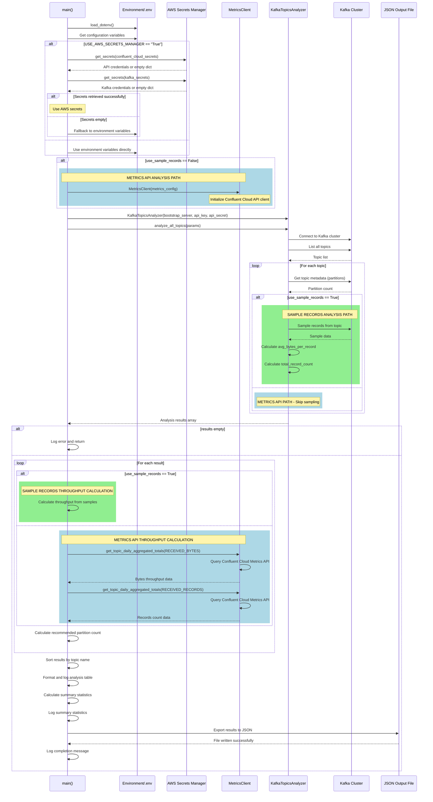

# Kafka Topics Partition Count Recommender Application

> **TL;DR:** _**End Kafka performance headaches.** This smart recommender reads your historical consumption data and delivers precise partition recommendations that optimize throughput and enable effortless scaling—no more over-provisioning or under-utilizing your topics._


The **Kafka Cluster Topics Partition Count Recommender Application** offers data-driven accuracy for Kafka topic sizing. By analyzing past consumption trends, that is, the average consumption records in bytes, it uses this information to determine consumer throughput. Then, over a rolling seven-day period, it identifies the peak consumption of records in bytes, scaling that number by a factor of X to forecast future demand and calculate the required throughput. Next, it divides the required throughput by the consumer throughput and rounds the result to the nearest whole number to determine the optimal number of partitions. The result is an intelligent, automated recommendation system that ensures each Kafka topic has the appropriate number of partitions to handle current workload and support future growth effectively.

**Table of Contents**

<!-- toc -->
- [**1.0 To get started**](#10-to-get-started)
   + [**1.1 Download the Application**](#11-download-the-application)
   + [**1.2 Configure the Application**](#12-configure-the-application)
      - [**1.2.1 Create the `.env` file**](#121-create-the-env-file)
      - [**1.2.2 Using the AWS Secrets Manager (optional)**](#122-using-the-aws-secrets-manager-optional)
   + [**1.3 Run the Application**](#13-run-the-application)
      - [**1.3.1 Did you notice we prefix `uv run` to `python src/app.py`?**](#131-did-you-notice-we-prefix-uv-run-to-python-srcapppy)
      - [**1.3.2 Troubleshoot Connectivity Issues (if any)**](#132-troubleshoot-connectivity-issues-if-any)
- [**2.0 How the app calculates the recommended partition count**](#20-how-the-app-calculates-the-recommended-partition-count)
   + [**2.1 End-to-End Application Workflow**](#21-end-to-end-application-workflow)
- [**3.0 Unlocking High-Performance Consumer Throughput**](#30-unlocking-high-performance-consumer-throughput)
   + [**3.1 Key Factors Affecting Consumer Throughput**](#31-key-factors-affecting-consumer-throughput)
      - [**3.1.1 Partitions**](#311-partitions)
      - [**3.1.2 Consumer Parallelism**](#312-consumer-parallelism)
      - [**3.1.3 Fetch Configuration**](#313-fetch-configuration)
      - [**3.1.4 Batch Size**](#314-batch-size)
      - [**3.1.5 Message Size**](#315-message-size)
      - [**3.1.6 Network Bandwidth**](#316-network-bandwidth)
      - [**3.1.7 Deserialization Overhead**](#317-deserialization-overhead)
      - [**3.1.8 Broker Load**](#318-broker-load)
      - [**3.1.9 Consumer Poll Frequency**](#319-consumer-poll-frequency)
      - [**3.1.10 System Resources**](#310-system-resources)
+ [**3.2 Typical Consumer Throughput**](#32-typical-consumer-throughput)
+ [**3.3 Seven Strategies to Improve Consumer Throughput**](#33-seven-strategies-to-improve-consumer-throughput)
- [**4.0 Resources**](#40-resources)
   + [**4.1 Optimization Guides**](#41-optimization-guides)
   + [**4.2 Confluent Cloud Metrics API**](#42-confluent-cloud-metrics-api)
   + [**4.3 Confluent Kafka Python Client**](#43-confluent-kafka-python-client)
<!-- tocstop -->

## 1.0 To get started

### 1.1 Download the Application
Clone the repo:
    ```shell
    git clone https://github.com/j3-signalroom/kafka_cluster-topics-partition_count_recommender-app.git
    ```

Since this project was built using [**`uv`**](https://docs.astral.sh/uv/), please [install](https://docs.astral.sh/uv/getting-started/installation/) it, and then run the following command to install all the project dependencies:
   ```shell
   uv sync
   ```

### 1.2 Configure the Application

Now, you need to set up the application by creating a `.env` file in the root directory of your project. This file will store all the essential environment variables required for the application to connect to your Confluent Cloud Kafka cluster and function correctly. Additionally, you can choose to use **AWS Secrets Manager** to manage your secrets.

> **Note**: _Your Confluent Cloud API Key, Secret, and Kafka Cluster ID are required to access the [Confluent Cloud Metrics API](https://api.telemetry.confluent.cloud/docs#section/Authentication) and retrieve topic metrics. Additionally, your Bootstrap Server URI, along with your Kafka API Key and Secret, are necessary to access the designated Kafka Cluster._

#### 1.2.1 Create the `.env` file
Create the `.env` file and add the following environment variables, filling them with your Confluent Cloud credentials and other required values:
   ```shell
   BOOTSTRAP_SERVER_URI=<YOUR_BOOTSTRAP_SERVER_URI>
   CONFLUENT_CLOUD_API_KEY=<YOUR_CONFLUENT_CLOUD_API_KEY>
   CONFLUENT_CLOUD_API_SECRET=<YOUR_CONFLUENT_CLOUD_API_SECRET>
   INCLUDE_INTERNAL_TOPICS=False
   KAFKA_API_KEY=<YOUR_KAFKA_API_KEY>
   KAFKA_API_SECRET=<YOUR_KAFKA_API_SECRET>
   KAFKA_CLUSTER_ID=<YOUR_KAFKA_CLUSTER_ID>

   REQUIRED_CONSUMPTION_THROUGHPUT_FACTOR=<YOUR_REQUIRED_CONSUMPTION_THROUGHPUT_FACTOR>

   USE_SAMPLE_RECORDS=<True|False>
   SAMPLING_DAYS=7
   SAMPLING_BATCH_SIZE=1000
   
   TOPIC_FILTER=

   USE_AWS_SECRETS_MANAGER=<True|False>
   AWS_REGION_NAME=<YOUR_AWS_REGION_NAME>
   CONFLUENT_CLOUD_API_KEY_AWS_SECRETS=<YOUR_CONFLUENT_CLOUD_API_KEY_AWS_SECRETS>
   KAFKA_API_KEY_AWS_SECRETS=<YOUR_KAFKA_API_KEY_AWS_SECRETS>
   ```

The environment variables are defined as follows:

| Environment Variable Name  | Description |
| ----------------------------------------| ----------- |
| `BOOTSTRAP_SERVER_URI` | Tshe bootstrap server URI for your Kafka cluster (e.g., `pkc-xxxxxx.us-east-1.aws.confluent.cloud:9092`). |
| `CONFLUENT_CLOUD_API_KEY` | Your Confluent Cloud API Key. |
| `CONFLUENT_CLOUD_API_SECRET` | Your Confluent Cloud API Secret. |
| `INCLUDE_INTERNAL_TOPICS` | Set to `True` if you want to include internal topics in the analysis; otherwise, set to `False`. |
| `KAFKA_API_KEY` | Your Kafka API Key. |
| `KAFKA_API_SECRET` | Your Kafka API Secret. |
| `KAFKA_CLUSTER_ID` | The ID of your Kafka cluster (e.g., `lkc-123xyz`). |
| `REQUIRED_CONSUMPTION_THROUGHPUT_FACTOR` | A multiplier to scale the peak consumption for future demand forecasting (e.g., `1.5` for 150%). |
| `USE_SAMPLE_RECORDS` | Set to `True` if you want to sample records for analysis; otherwise, set to `False`. |
| `SAMPLING_BATCH_SIZE` | The number of records to sample if `USE_SAMPLE_RECORDS` is set to `True` (e.g., `1000`). |
| `SAMPLING_DAYS` | The number of days to look back when sampling records if `USE_SAMPLE_RECORDS` is set to `True` (e.g., `7`). |
| `TOPIC_FILTER` | A comma-separated list of topic names to include in the analysis. Leave empty to include all topics. |
| `USE_AWS_SECRETS_MANAGER` | Set to `True` if you want to use AWS Secrets Manager to manage your secrets; otherwise, set to `False`. |
| `AWS_REGION_NAME` | The AWS region where your secrets are stored (e.g., `us-east-1`). |
| `CONFLUENT_CLOUD_API_KEY_AWS_SECRETS` | The name of the AWS Secrets Manager secrets that contains your Confluent Cloud API Key and secret. |
| `KAFKA_API_KEY_AWS_SECRETS` | The name of the AWS Secrets Manager secrets that contains your Kafka Cluster API Key, API Secret, Kafka Cluster ID, and bootstrap server URI. |

#### 1.2.2 Using the AWS Secrets Manager (optional)
If you use **AWS Secrets Manager** to manage your secrets, set the `USE_AWS_SECRETS_MANAGER` variable to `True` and the application will retrieve the secrets from AWS Secrets Manager using the names provided in `CONFLUENT_CLOUD_API_KEY_AWS_SECRETS` and `KAFKA_API_KEY_AWS_SECRETS`.  

The code expects the `CONFLUENT_CLOUD_API_KEY_AWS_SECRETS` to be stored in JSON format with these keys:
- `confluent_cloud_api_key`
- `confluent_cloud_api_secret`

The code expects the `KAFKA_API_KEY_AWS_SECRETS` to be stored in JSON format with these keys:
- `kafka_cluster_id` 
- `bootstrap.servers`
- `sasl.username`
- `sasl.password`

### 1.3 Run the Application

**Navigate to the Project Root Directory**

Open your Terminal and navigate to the root folder of the `kafka_cluster-topics-partition_count_recommender-app/` repository that you have cloned. You can do this by executing:

```shell
cd path/to/kafka_cluster-topics-partition_count_recommender-app/
```

> Replace `path/to/` with the actual path where your repository is located.

Then enter the following command below to run the application:
```shell
uv run python src/app.py
```

If `USE_SAMPLE_RECORDS` environment variable is set to `True`, the application will sample records from each topic to calculate the average record size in bytes.  For example, below is a screenshot of the application running successfully:


If `USE_SAMPLE_RECORDS` is set to `False`, the application will use the Confluent Cloud Metrics API to retrieve the average and peak consumption in bytes over a rolling seven-day period.  For example, below is a screenshot of the application running successfully:


#### 1.3.1 Did you notice we prefix `uv run` to `python src/app.py`?
You maybe asking yourself why.  Well, `uv` is an incredibly fast Python package installer and dependency resolver, written in [**Rust**](https://github.blog/developer-skills/programming-languages-and-frameworks/why-rust-is-the-most-admired-language-among-developers/), and designed to seamlessly replace `pip`, `pipx`, `poetry`, `pyenv`, `twine`, `virtualenv`, and more in your workflows. By prefixing `uv run` to a command, you're ensuring that the command runs in an optimal Python environment.

Now, let's go a little deeper into the magic behind `uv run`:
- When you use it with a file ending in `.py` or an HTTP(S) URL, `uv` treats it as a script and runs it with a Python interpreter. In other words, `uv run file.py` is equivalent to `uv run python file.py`. If you're working with a URL, `uv` even downloads it temporarily to execute it. Any inline dependency metadata is installed into an isolated, temporary environment—meaning zero leftover mess! When used with `-`, the input will be read from `stdin`, and treated as a Python script.
- If used in a project directory, `uv` will automatically create or update the project environment before running the command.
- Outside of a project, if there's a virtual environment present in your current directory (or any parent directory), `uv` runs the command in that environment. If no environment is found, it uses the interpreter's environment.

So what does this mean when we put `uv run` before `python src/app.py`? It means `uv` takes care of all the setup—fast and seamless—right in your local environment. If you think AI/ML is magic, the work the folks at [Astral](https://astral.sh/) have done with `uv` is pure wizardry!

Curious to learn more about [Astral](https://astral.sh/)'s `uv`? Check these out:
- Documentation: Learn about [`uv`](https://docs.astral.sh/uv/).
- Video: [`uv` IS THE FUTURE OF PYTHON PACKING!](https://www.youtube.com/watch?v=8UuW8o4bHbw).

If you have Kafka connectivity issues, you can verify connectivity using the following command:

#### 1.3.2 Troubleshoot Connectivity Issues (if any)

To verify connectivity to your Kafka cluster, you can use the `kafka-topics.sh` command-line tool.  First, download the Kafka binaries from the [Apache Kafka website](https://kafka.apache.org/downloads) and extract them. Navigate to the `bin` directory of the extracted Kafka folder. Second, create a `client.properties` file with your Kafka credentials:

```shell
# For SASL_SSL (most common for cloud services)
security.protocol=SASL_SSL
sasl.mechanism=PLAIN
sasl.jaas.config=org.apache.kafka.common.security.plain.PlainLoginModule required \
  username="<YOUR_KAFKA_API_KEY>" \
  password="<YOUR_KAFKA_API_SECRET>";

# Additional SSL settings if needed
ssl.endpoint.identification.algorithm=https
```

Finally, run the following command to list all topics in your Kafka cluster:
```shell
./kafka-topics.sh --list --bootstrap-server <YOUR_BOOTSTRAP_SERVER_URI> --command-config ./client.properties
```

If the connection is successful, you should see a list of topics in your Kafka cluster. If you encounter any errors, double-check your credentials and network connectivity.

## 2.0 How the app calculates the recommended partition count
The app uses the Kafka `AdminClient` to retrieve all Kafka Topics (based on the `TOPIC_FILTER` specified) stored in your Kafka Cluster, including the original partition count per topic. Then, it iterates through each Kafka Topic, calling the Confluent Cloud Metrics RESTful API to retrieve the topic’s average (i.e., the _Consumer Throughput_) and peak consumption in bytes over a rolling seven-day period. Next, it calculates the required throughput by multiplying the peak consumption by the `REQUIRED_CONSUMPTION_THROUGHPUT_FACTOR` (i.e., the _Required Throughput_). Finally, it divides the required throughput by the consumer throughput and rounds the result to the nearest whole number to determine the optimal number of partitions.

> **Note**: _This why the app requires the Kafka API Key and Secret to connect to your Kafka Cluster via the AdminClient, and the Confluent Cloud API Key and Secret to connect to the Confluent Cloud Metrics API._

For example, suppose you have a consumer that consumes at **25MB/s**, but the the consumer requirement is a throughput of **1.22GB/s**.  How many partitions should you have?

To determine the number of partitions needed to support a throughput of **1.22GB/s** for a Kafka consumer that can only consume at **25MB/s**, you can calculate it as follows:

1. Convert the target throughput to the same units:
   - **1.22GB/s = 1250MB/s**

2. Divide the target throughput by the consumer's capacity:

    

3. Since you can only have a whole number of partitions, you should always round up to the nearest whole number:

    

The **50 partitions** ensure that the consumer can achieve the required throughput of **1.22GB/s** while consuming at a rate of **25MB/s** per partition. This will allow the workload to be distributed across partitions so that multiple consumers can work in parallel to meet the throughput requirement.

#### 2.1 End-to-End Application Workflow


### 3.0 Unlocking High-Performance Consumer Throughput

The throughput of a **Kafka consumer** refers to the rate at which it can read data from Kafka topics, typically measured in terms of **megabytes per second (MB/s)** or **records per second**. Consumer throughput depends on several factors, including the configuration of Kafka, the consumer application, and the underlying infrastructure.

#### 3.1 Key Factors Affecting Consumer Throughput

##### 3.1.1 Partitions
- Throughput scales with the number of partitions assigned to the consumer. A consumer can read from multiple partitions concurrently, but the total throughput is bounded by the number of partitions and their data production rates.
- Increasing the number of partitions can improve parallelism and consumer throughput.

##### 3.1.2 Consumer Parallelism
- A single consumer instance reads from one or more partitions, but it can be overwhelmed if the data rate exceeds its capacity.
- Adding more consumers in a consumer group increases parallelism, as Kafka reassigns partitions to balance the load.

##### 3.1.3 Fetch Configuration
- **`fetch.min.bytes`**: Minimum amount of data (in bytes) the broker returns for a fetch request. Larger values reduce fetch requests but may introduce latency.
- **`fetch.max.bytes`**: Maximum amount of data returned in a single fetch response. A higher value allows fetching larger batches of messages, improving throughput.
- **`fetch.max.wait.ms`**: Maximum time the broker waits before responding to a fetch request. A higher value can increase batch sizes and throughput but may increase latency.

For more details, see the [Confluent Cloud Client Optimization Guide - Consumer Fetching](https://docs.confluent.io/cloud/current/client-apps/optimizing/throughput.html#consumer-fetching).

##### 3.1.4 Batch Size
- Consumers process messages in batches for better efficiency. Larger batches reduce processing overhead but require sufficient memory.
- Configuration: **`max.poll.records`** controls the number of records fetched in a single poll.

##### 3.1.5 Message Size
- Larger messages can reduce throughput if the network or storage systems are bottlenecks. Use compression (e.g., `lz4`, `snappy`) to optimize data transfer.

##### 3.1.6 Network Bandwidth
- Network speed between Kafka brokers and consumers is critical. A consumer running on a limited-bandwidth network will see reduced throughput.

##### 3.1.7 Deserialization Overhead
- The time required to deserialize records impacts throughput. Efficient deserialization methods (e.g., Avro, Protobuf with optimized schemas) can help.

##### 3.1.8 Broker Load
- Broker performance and replication overhead impact the throughput seen by consumers. If brokers are under heavy load, consumer throughput may decrease.

##### 3.1.9 Consumer Poll Frequency
- Consumers must frequently call `poll()` to fetch messages. If the consumer spends too much time processing messages between polls, throughput can drop.

##### 3.1.10 System Resources
- CPU, memory, and disk I/O on the consumer’s machine affect how fast it can process data.

### 3.2 Typical Consumer Throughput
- **Single Partition Throughput**: A single consumer reading from a single partition can typically achieve **10-50 MB/s** or higher, depending on record size, compression, and hardware.
- **Multi-Partition Throughput**: For a consumer group reading from multiple partitions, throughput can scale linearly with the number of partitions (subject to other system limits).

### 3.3 Seven Strategies to Improve Consumer Throughput
1. **Increase Partitions**: Scale partitions to allow more parallelism.
2. **Add Consumers**: Add more consumers in the consumer group to distribute the load.
3. **Optimize Fetch Settings**: Tune `fetch.min.bytes`, `fetch.max.bytes`, and `fetch.max.wait.ms`.
4. **Batch Processing**: Use `max.poll.records` to fetch and process larger batches.
5. **Compression**: Enable compression to reduce the amount of data transferred.
6. **Efficient SerDe (Serialization/Deserialization)**: Use optimized serializers and deserializers.
7. **Horizontal Scaling**: Ensure consumers run on high-performance hardware with sufficient network bandwidth.

By optimizing these factors, Kafka consumers can achieve higher throughput tailored to the specific use case and infrastructure.

## 4.0 Resources

### 4.1 Optimization Guides
- [Optimize Confluent Cloud Clients for Throughput](https://docs.confluent.io/cloud/current/client-apps/optimizing/throughput.html#optimize-ccloud-clients-for-throughput)
- [Choose and Change the Partition Count in Kafka](https://docs.confluent.io/kafka/operations-tools/partition-determination.html#choose-and-change-the-partition-count-in-ak)

### 4.2 Confluent Cloud Metrics API
- [Confluent Cloud Metrics API](https://api.telemetry.confluent.cloud/docs)
- [Confluent Cloud Metrics API: Metrics Reference](https://api.telemetry.confluent.cloud/docs/descriptors/datasets/cloud)
- [Confluent Cloud Metrics](https://docs.confluent.io/cloud/current/monitoring/metrics-api.html#ccloud-metrics)

### 4.3 Confluent Kafka Python Client
- [Confluent Kafka Python Client Documentation](https://docs.confluent.io/platform/current/clients/confluent-kafka-python/html/index.html)
